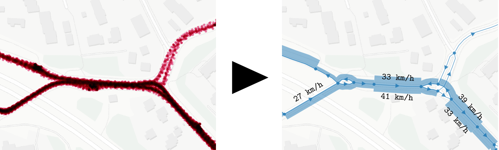

# Sujuiko database

The purpose of this tool is to enable analysis of public transport service in the past at a more detailed level than transit stops, and, on the other hand, at the general transit network level.
This is done by aggregating historical [high-frequency positioning data](https://digitransit.fi/en/developers/apis/4-realtime-api/vehicle-positions/) (HFP) points projected onto a transit network consisting of links and nodes.
Currently, this very experimental tool is developed using the [HSL](hsl.fi/) bus and tram data only, as well as the related OpenStreetMap network and GTFS data.
Development is based on an HFP raw data set from November 2019, but in future the tool should support analyzing much longer periods of time.

By using the tool, one should be able to answer the following questions, for example:

- A given transit line seems to get always delayed between stops A and B.
What is happening along the network route between A and B?
Where do the vehicles tend to stop, and for how long at each location?
- What is the average speed and its standard deviation of transit vehicles that went through a given link, or from point A to point B using the same path on the network?
- How many seconds do transit vehicles in average remain stopped at a given intersection?
- How do these measures vary in time, e.g., between two different weeks, working days vs. weekends, or peak hours vs. off-peak?
- What are the "worst" links on the network causing delays, in relation to a weight measure such as number of scheduled trips per link?

# Requirements

You will need the following:

- The tool is being developed on an Ubuntu 18.04 LTS server with 2 TB of disk space, 8 GB RAM and 2 CPU cores.
I use some Bash scripts and therefore have not tested anything on Windows.
- [PostgreSQL](https://www.postgresql.org/) 11 *(planning to upgrade to 12 though)*.
This is the core of the tool.
Also majority of the data transformation logic is written in PLPGSQL.
- [PostGIS](https://postgis.net/) 3.0.
Provides the numerous spatial operations required.
- [pgRouting](http://docs.pgrouting.org/latest/en/index.html) 3.0.
I use this to establish the node-link network and to find the shortest paths for transit routes on the network.
- [TimescaleDB](https://docs.timescale.com/latest/main) >= 1.5.
Smart timestamp column based table partitioning needed to manage huge amounts of the HFP data.

Unfortunately, there is no automated deployment process.
Having installed the aforementioned software, create a database named `hfp` as `postgres` superuser, and you should be able to run the DDL scripts in [`db/ddl`](/db/ddl).
*NOTE:* Due to ongoing development, the scripts cannot be yet run neatly "as a whole" from scratch.

# Data model & data import and transformation

The tool uses a logig called "extract-load-transform", i.e., I try to avoid additional tools and libraries for data wrangling beforehand, and instead I have included as much as possible of the application logic *inside the Postgres database*.
You can read more about this philosophy e.g. from [The Art of PostgreSQL](https://theartofpostgresql.com/) by Dimitri Fontaine.
This is obviously not the best possible approach, since PLPGSQL language has turned out powerful yet very inflexible in many ways, but I decided to give it a try and we're on that track now.

## Data sources

- [HFP from Digitransit](https://digitransit.fi/en/developers/apis/4-realtime-api/vehicle-positions/) - this is real-time data but you can collect it yourself e.g. with this [hfplogger](https://github.com/datarttu/hfplogger) tool (a bit messy).
I am using a data dump from HSL.
- HSL [GTFS dump](https://transitfeeds.com/p/helsinki-regional-transport/735/20191101) as it was on 1 November 2019.
This provides us with the transit schedules as well as stop point locations.
- [OpenStreetMap](openstreetmap.org/) subset: the current tool needs a dataset containing ways in Helsinki region that are used by any bus route in OSM (bus relations - this is far from perfect but better than downloading all the possible highways, 99 % of which could be but are not really used by any bus route) and `railway=tram` ways (surprisingly good data, though some intersections have not been modeled properly).

Note that the current tool does *not* support incremental changes to the transit schedule (GTFS) and network (OSM) model.
It assumes that these data remain static, which is a relatively realistic assumption when we analyse data from a single month only.
For longer term analyses, it should of course be possible to import new GTFS data on top of older data, and to account for network changes as the time goes by (e.g. building sites, new or moved stops, etc).

**TODO: reference to database model & data flow docs.**

# Author

Arttu Kosonen, [@datarttu](https://github.com/datarttu), HSL / Aalto University, 2019-2020.
Developing this tool is essentially part of my master's thesis in Spatial Planning and Transportation Engineering.
