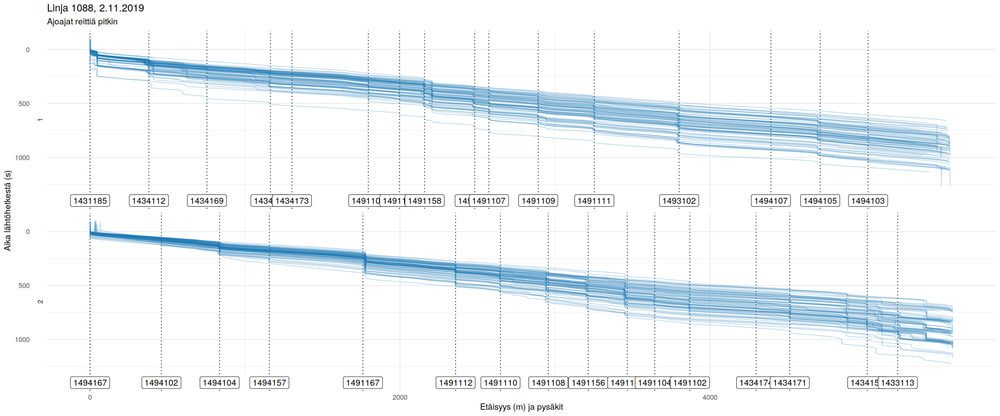
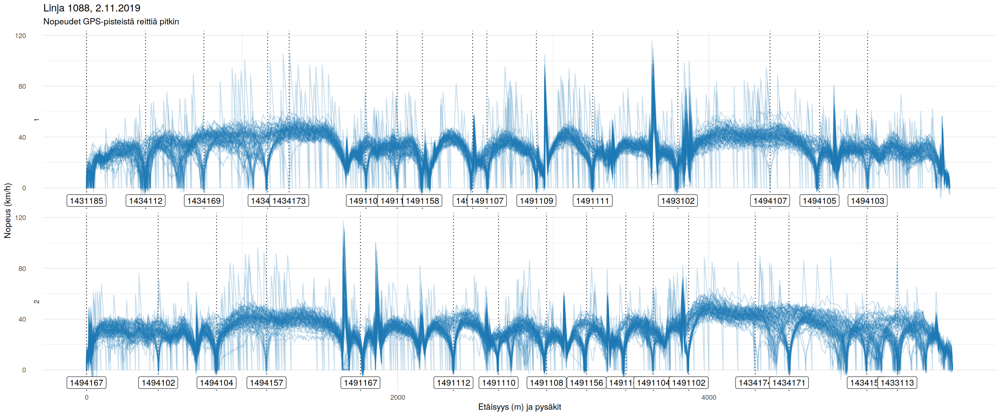

# Sujuiko database


The purpose of this tool is to enable analysis of public transport service in the past at a more detailed level than transit stops, and, on the other hand, at the general transit network level.
This is done by aggregating historical [high-frequency positioning data](https://digitransit.fi/en/developers/apis/4-realtime-api/vehicle-positions/) (HFP) points projected onto a transit network consisting of links and nodes.
Currently, this very experimental tool is developed using the [HSL](hsl.fi/) bus and tram data only, as well as the related OpenStreetMap network and GTFS data.
Development is based on an HFP raw data set from November 2019, but in future the tool should support analyzing much longer periods of time.

By using the tool, one should be able to answer the following questions, for example:

- A given transit line seems to get always delayed between stops A and B.
What is happening along the network route between A and B?
Where do the vehicles tend to stop, and for how long at each location?
- What is the average speed and its standard deviation of transit vehicles that went through a given link, or from point A to point B using the same path on the network?
- How many seconds do transit vehicles in average remain stopped at a given intersection?
- How do these measures vary in time, e.g., between two different weeks, working days vs. weekends, or peak hours vs. off-peak?
- What are the "worst" links on the network causing delays, in relation to a weight measure such as number of scheduled trips per link?

The general idea is that we do not store every single HFP observation as a point geometry but instead, we store a reference to a network link that is used by a set of successive observations, and an array of relative time and location values for those observations along the link.
As a result, we can inspect time-space profiles along sequences of links like these ...





... and, finally, aggregate that data by link, route or other common attributes.

To reliably project the HFP data onto the network links, we also need a reasonable schedule and trip path model.
This enables finding a "planned entity" for each HFP journey by route, direction and start time.
The schedule model in turn enables analyzing planned-vs-operated time metrics such as schedule adherence, in addition to metrics that come purely from the HFP and network data (such as average operating time through a set of links).

# Requirements

The tool is being developed on an Ubuntu 18.04 LTS server with 2 TB of disk space, 8 GB RAM and 2 CPU cores.
I have not tested anything on Windows.

You will need the following, either installed on the machine or by using Docker (deployment instructed below):

- [PostgreSQL](https://www.postgresql.org/) 13.
This is the core of the tool.
Also majority of the data transformation logic is written in PLPGSQL.
- [PostGIS](https://postgis.net/) 3.
Core of the geometries and spatial operations.
- [pgRouting](http://docs.pgrouting.org/latest/en/index.html) 3.
Core of the routable network model.
- [TimescaleDB](https://docs.timescale.com/latest/main) 2.
Supports partitioning and managing large amounts of the HFP data.

# Development

This is how you should get the database up and running for development purposes.
For production, you may want to create and fill the database using a PostgreSQL cluster installed directly on your server.

```
git clone https://github.com/datarttu/sujuikoDB
cd sujuikoDB
cp .env_test .env
```

Now configure the values in `.env` according to your local environment.
For instance, you may want to use a custom Postgres port instead of `5432` if a Postgres cluster is already running on your system.
Also check that the `docker-compose` files suit your needs.
Then build the Docker image:

```
docker build -t datarttu/sujuikodb:latest .
```

## Testing the DDL and data imports with example data

1. Start the *test run* version of the database: `docker-compose -f docker-compose.test.yml up`.
1. Check `db` and `dataimporter` log entries in your terminal. They should end successfully after the `COPY` commands (like `sujuikodb_dataimporter_1 exited with code 0`).
1. `Ctrl-C` and `docker-compose -f docker-compose.test.yml down` to exit and remove the services.

The database data is saved on a temporary volume that is removed after removing the services.

## Testing with a persistent database

1. In `.env`, set `IMPORT_DATA_DIR` to a directory containing the import files you want into the database, as well as `import.sql` script, structured the same way as in [`example_data/`](./example_data/).
1. Start the database: `docker-compose -f docker-compose.db.yml up`.
1. Check `db` and `dataimporter` log entries in your terminal. They should end successfully after the `COPY` commands (like `sujuikodb_dataimporter_1 exited with code 0`).
1. Now you can connect to the database e.g. with psql or QGIS, using `localhost` and the connection parameters you set in `.env`.

Here, a Docker volume `db_volume` is created and the database data is kept there between `docker-compose` runs unless you explicitly remove the volume.

Should you run any incremental / ad-hoc changes to the database, they are saved on `db_volume` and the database state will be the same if you restart the services.

**NOTE:** If you restart the database with pre-existing `db_volume` and data imported to it, the `dataimporter` service will fail the imports because of primary key conflicts.

# Data model & data import and transformation

The tool uses a logig called "extract-load-transform", i.e., I try to avoid additional tools and libraries for data wrangling beforehand, and instead I have included as much as possible of the application logic *inside the Postgres database*.
You can read more about this philosophy e.g. from [The Art of PostgreSQL](https://theartofpostgresql.com/) by Dimitri Fontaine.
This is obviously not the best possible approach, since PLPGSQL language has turned out powerful yet very inflexible in many ways, but I decided to give it a try and we're on that track now.

## Data sources

- [HFP from Digitransit](https://digitransit.fi/en/developers/apis/4-realtime-api/vehicle-positions/) - this is real-time data but you can collect it yourself e.g. with this [hfplogger](https://github.com/datarttu/hfplogger) tool (a bit messy).
I am using a data dump from HSL.
- HSL [GTFS dump](https://transitfeeds.com/p/helsinki-regional-transport/735/20191101) as it was on 1 November 2019.
This provides us with the transit schedules as well as stop point locations.
- [OpenStreetMap](openstreetmap.org/) subset: the current tool needs a dataset containing ways in Helsinki region that are used by any bus route in OSM (bus relations - this is far from perfect but better than downloading all the possible highways, 99 % of which could be but are not really used by any bus route) and `railway=tram` ways (surprisingly good data, though some intersections have not been modeled properly).

Note that the current tool does *not* support incremental changes to the transit schedule (GTFS) and network (OSM) model.
It assumes that these data remain static, which is a relatively realistic assumption when we analyse data from a single month only.
For longer term analyses, it should of course be possible to import new GTFS data on top of older data, and to account for network changes as the time goes by (e.g. building sites, new or moved stops, etc).

**Database model in more detail in [`db README`](db)**.

# Author

Arttu Kosonen, [@datarttu](https://github.com/datarttu), HSL / Aalto University, 2019-2020.
Developing this tool is essentially part of my master's thesis in Spatial Planning and Transportation Engineering.
