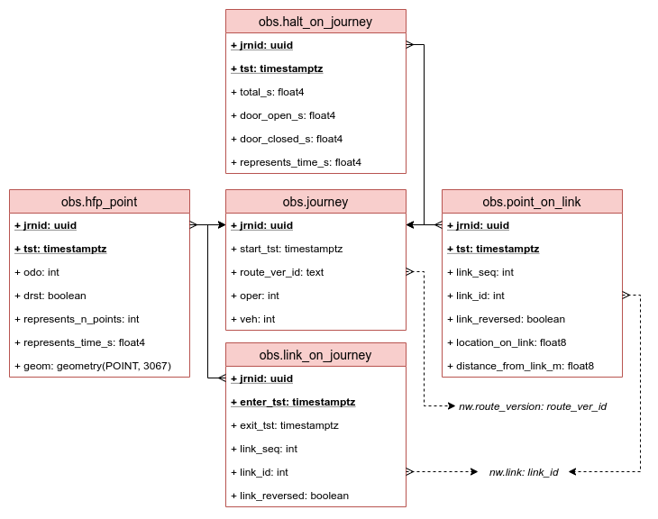

# Database model

The sujuiko database uses two schemas:

- `nw`, as in "network", models the transit network and transit routes on it, as well as parts of the network selected for analyses.
- `obs` _(not yet implemented)_, as in "observations", models actual transit vehicle movements on the network as well as various aggregates and analysis results based on the movements.

Extensions and objects not specific to an individual schema, such as generic helper functions, are created in the default `public` schema.

## General notes

The database uses some [extensions](./010_global.sql):

- `btree_gist`, provided by PostgreSQL itself, allows including `=` equality operator to `EXCLUDE` constraints that would normally only work with range operators.
- [`postgis`](https://postgis.net/docs/manual-3.0/) provides geometry types and various geoprocessing functions, we use it especially for "project point to line"-type calculations.
- [`pgrouting`](https://docs.pgrouting.org/latest/en/) helps us find shortest paths to model routes and analysis sections on the network.
- [`timescaledb`](https://docs.timescale.com/latest/main) automates partitioning of large HFP observation tables by timestamp columns and provides some nice time-series functions.
TimescaleDB affects the database instance at a bit deeper level, and it is recommended by the provider to [optimize](./001_timescaledb_tune.sh) the instance performance.

All the geometry columns use **SRID 3067 (ETRS-TM35FIN)**.
This is a metric coordinate system, meaning it is more straightforward with geospatial functions such as `ST_Distance()`, and it works pretty accurately in the HSL / Greater Helsinki area.
This SRID is hard-coded to the DDL and should be changed if the model is applied to a different area, but this is not likely to happen at the moment.

## Data validation

There are some logical rules and assumptions in the data model that are not strictly modeled and enforced by foreign keys but are still required for consistent results.
For example, ordered links on route should form a continuous path (by route version) without gaps, but it is possible to save arbitrary data to `nw.link_on_route` against that principle: enforcing this by constraints or triggers would make data modifications more difficult, and it would also be costly in terms of complex and repetitive queries.

Adherence to such rules and assumptions can be checked with validation procedures.
Most relations have an array field `errors`: if a row is found invalid according to a rule, the validation procedure adds an error label to this field.

The rules are defined in [`validation-rules.csv`](./validation-rules.csv).

### Usage

For example, the following would reset the `errors` field of `nw.link` from old values, run link-specific validations and tag `nw.link` rows breaking the validation criteria:

```
> CALL nw.validate_links();
```

We could then look up the rows with any errors:

```
> SELECT * FROM nw.link WHERE cardinality(errors) > 0;
```

Or find links breaking a particular rule:

```
> SELECT * FROM nw.link WHERE errors @> array['start_end_same_point'];
```

Individual validation functions return a set of rows of the target relation that break the rule, and the callable procedures just run `UPDATE` statements according to them.
This means we can check individual rules also on the fly, without updating the `errors` field, if we like:

```
> SELECT * FROM nw.vld_link_start_end_same_point();
```

Finally, we can run all the network validations with one command:

```
> CALL nw.validate_all();
```

## `nw` network model


### Relations and views

#### `nw.node`

Geographical points where links start and end.
Nodes should be unique not only by `node_id` but also geographically: no two nodes should be in the same point, given a decent coordinate precision.
Nodes breaking this rule can be found with this function that is also included in the `nw.validate_nodes()` procedure:

```
SELECT * FROM nw.vld_node_duplicated_node();
```

See [node example data](../example_data/node.csv) that can be imported through the `nw.view_node_wkt` view.
This is possible with an `INSTEAD OF INSERT` trigger that calls the `nw.tg_insert_wkt_node()` function.

#### `nw.link`

Connected parts of street or tram network where buses and/or trams can drive.
Links must have a start (i) and end (j) node located in the start and end points of the link geometry.

Links can be two-way or oneway (traversing allowed only from i to j).

A link can allow multiple modes, if in reality buses and trams use the same lane and street space, for example.
This is why `link_modes` is an array rather than a single value.

The `nw.view_link_directed` view helps creating route and section paths, where the traversal direction of a link must be known exactly (by `link_reversed`).

See [link example data](../example_data/link.csv) that can be imported through the `nw.view_link_wkt` view.

#### `nw.stop`

Points along the transit network where passengers can board and alight transit vehicles.
More importantly than the point location, a stop must have a "projected" location along a directed link, so the stop location can be analyzed and visualized together with vehicle movements on the link.
The projected location is modeled by `link_id`, `link_reversed`, and `location_on_link` (float 0 ... 1, relative to the link length).
`stop_radius_m` is then used to create "coverage distances" before and after the projected point.
For instance, `halt_on_journey` points falling within such areas will get corresponding `stop_id` references, and this way halt events at stops and elsewhere can be analyzed separately.

If `link_reversed` is `false`, `location_on_link` value shows the relative position of the stop along the original link geometry.
If `link_reversed` is `true`, the relative position is calculated using the reverse geometry of the link, or from `j_node` to `i_node`.
`link_reversed` cannot be `true` for `oneway = true` links since they cannot be traversed to the opposite direction.
`link_reversed` also determines which direction version of a two-way link will be used when creating `nw.link_on_route` sequences from `nw.stop_on_route` sequences.

`link_ref_manual` can be set to `true` to omit a stop from batch modifications to the stop-link references, e.g., in case a stop has been manually connected to a link different than a link closest (default) to the stop point.

Note that `stop_radius_m` is not exactly the same as stop radius in Jore - in fact, the term used here is a bit misleading.
The Jore value means simple geographical radius along the stop point as is used e.g. when detecting arrivals and departures from the stop area.
Here, in contrast, the radius value is used to create stop "coverage" distances back- and forwards from the _projected_ stop point along the link that the stop is attached to.
The idea is the same, though: marking areas on the network where halts and door events are (probably) related to a specific stop.
Also note that the stop coverage distances are capped to the link ends, should the stop be located near to the start or the end of a link.
Extending the area to the next/previous link would be a complex task, especially in intersections with more than two links at a node.

#### `nw.route_version`

Passenger service of a transit `route` and direction `dir` that has been valid during a date range `valid_during`.
The ordered stops server by the route its direction may have changed (either permanently, or temporarily due to a construction site, for instance), and any such change should cause a new route version with new `valid_during` validity time to be issued.

`route_ver_id` is a surrogate primary key and should be created as `<route>_<dir>_<valid_during_start_date>_<valid_during_end_date>` for readibility.

`route_mode` is used to select the allowed subset of network links for routing when the ordered set of `nw.link_on_route` is created with `pgr_dijkstra`.

#### `nw.stop_on_route`

Stops served by route versions, ordered by `stop_seq`.

`active_place` indicates that the stop is an "active [Hastus](https://www.giro.ca/en-ca/our-solutions/hastus-software/) place", meaning it is used as definitive point in the stop list for transit planning and measurements.

#### `nw.manual_vianode_on_route`

By default, ordered stops are used as basis for creating `link_on_route` paths for route versions.
With values in this table we can force a path to be routed via an additional node between stops.
It is well possible that the shortest path between a stop pair is not what we want.

Additional, or "manual", via nodes are defined *after* a stop by sequence number (therefore `after_stop_seq`).
If multiple via nodes are needed before the next stop, use `sub_seq` values for ordering.
If via nodes are needed before the first stop, use `after_stop_seq = 0`.

Consider this situation where we have last stops of a route version `1059_1_20200921_20201015`, `stop_seq` numbers 25 and 26:


By default, end nodes `j_node` of stop links are chosen as via nodes for routing (except for the 1st stop of a route version `i_node` is chosen).
So the path from 25 to 26 would go via nodes 4, 3 and 1.
But we see that the last stop is above the loop, so we could do the following:

```
> INSERT INTO nw.manual_vianode_on_route (route_ver_id, after_stop_seq, sub_seq, node_id)
  VALUES ('1059_1_20200921_20201015', 25, 1, 2);
```

So node 2 would be added between stop seq numbers 25 and 26 as *manual via node*, and the shortest path algorithm used to create the corresponding `nw.link_on_route` path would then correctly route via nodes 4, 3, 2 and 1.

The **`nw.view_vianode_on_route`** view combines via nodes automatically derived from stops-on-route with manually added via nodes.
The end of our example route version would look like this, note how the `sub_seq` and `stop_id` values indicate whether the via point is manual or derived from a stop:

```
> SELECT node_seq, stop_seq, sub_seq, stop_id, node_id FROM nw.view_vianode_on_route
  WHERE route_ver_id = '1059_1_20200921_20201015' AND stop_seq > 23;
  node_seq │ stop_seq │ sub_seq │ stop_id │ node_id
 ══════════╪══════════╪═════════╪═════════╪═════════
        24 │       24 │       0 │ 1465105 │      10
        25 │       25 │       0 │ 1461107 │       4
        26 │       25 │       1 │       ¤ │       2
        27 │       26 │       0 │ 1461109 │       1
```

This view would also show stops outside the network, i.e. `nw.stop` without `link_id` values and thus without node references too.
Such route versions or their stops must be fixed before `link_on_route` paths can be created.

#### `nw.link_on_route`

Links that form a continuous path of a route version along the network, ordered by `link_seq`.

If `link_reversed` is `false`, the route version traverses through the link `link_id` to the original, digitized direction.
If `link_reversed` is `true`, the link is traversed to the reverse direction (i.e., the `i_node` and `j_node` have been flipped in routing).

#### `nw.section`

Continuous part of the network selected for aggregations and analyses from `obs` data, and finally for reporting.

`section_id` can be any (preferably descriptive) string as long as it is unique.
`description` can be populated with a longer description text.

Only sections where `report IS true` are to be included in visualizations and reports; this attribute allows saving "draft" sections aside, for example, or making a larger batch of sections and then choosing which ones should be reported in the end.

`rotation` can be used to control the map view rotation angle of the section line geometry, to align it nicely with a landscape viewport, for example.

_TODO: Add an array for start-via-end nodes to control link_on_section creation process._

Note that section paths must not have branches or gaps: they work as `2D -> 1D` projections from the network geometries, allowing for space-time plotting, for example.
Also note that opposite versions of the same street section must be defined as separate analysis sections.

#### `nw.link_on_section`

Links that form a continuous path of an analysis section along the network, ordered by `link_seq`.
Technically, this works exactly the same way as `nw.link_on_route`.

### Data processing in the network model

Data for the `nw` tables is prepared outside the database and copied to the tables.
Some modifications and fixes may be needed, and they can be done to the import data or once the data is already in the database.
Below, further data processing inside the database is described in the correct order.

#### Connect stops to links

_TODO: Populate / update stop link reference fields, consider closest links and right hand side version of two-way links; do not touch `link_ref_manual IS true` stops; manual check on map afterwards; return to this step if incorrect route paths found_

#### Create route link paths

_TODO: Populate / update route link paths (`nw.link_on_route`) with `pgr_dijkstra`, `nw.stop_on_route` and `nw.view_link_directed`; check results; re-run for particular route versions with via nodes, or fix stop-link refs and/or network links and nodes if errors found_

_After this step, the modelled routes should correspond to the real ones in the past, and the database should be ready to receive and process HFP observation data._

#### Create analysis sections

_TODO: Add sections of network to use in analyses; define ids, descriptions and other attrs & start, via and end nodes; get shortest paths for sections and save to `nw.link_on_section`_

## `obs` observations model



### Relations and views


Above: Example map including `hfp_points` of a `journey` (blue points), `links_on_route` of that `journey`'s `route_version` (red lines), and `points_on_link` projected to the `links_on_route` (blue lines).
Here the link candidates have been picked within 20 meters between points and links: note how near the intersection there are multiple possible link matches for a point.
The current algorithm simply selects the closest link, but this would not work well if the route version used the same link twice or more, for example.

#### `obs.journey`

Realized transit service journeys that correspond to a route version (`route_ver_id`) by route, direction and operating day, have an exact scheduled initial departure time (`scheduled_start_utc`), and have been operated by a unique vehicle (`oper`, `veh`).
Note that the same scheduled journey might have been realized by multiple vehicles.
HFP points belonging to the same journey form a path in space and time.

Unique `jrnid` identifier is used as primary key so we do not have to deal with composite keys that would be more complex to join on and take up more space in large HFP observation tables.
Unlike sequential or other surrogate keys, this UUID key is actually derived from the data so we can ensure its correctness with other journey attributes if we want, and this is in fact done in the `obs.tg_insert_journey_handler()` trigger upon importing journey data.
`jrnid` is composed as follows:

```
md5('{route}_{dir}_{oday [yyyy-mm-dd]}_{start [HH:MM:SS]}_{oper}_{veh}')::uuid
```

`oday` and `start`, which are originally in local Finnish time, are converted into a single UTC timestamp in our data model.

`journeys` are imported directly from CSV files with `COPY FROM`.

#### `obs.hfp_point`

GPS points with EPSG:3067 coordinates `X, Y`, UTC timestamp `tst`, vehicle odometer value `odo` (in meters), and door open/closed status `drst`, belonging to a `journey`.
This data should be prepared from the raw HFP `VP` messages (using [hslhfp](https://github.com/datarttu/hslhfp)), which includes eliminating clear outliers, clustering points, where the vehicle is really stopped, into the same position, and removing redundant, repeated stopped points, for example.

`represents_n_points` tells how many _valid_ raw data points the point in question represents; when the vehicle has been stopped long enough (at least 3 s by default), redundant points have been deleted up to the last point before moving again, or before a door status change.
`represents_time_s` tells the same but in terms of `tst` timestamp difference up to the last deleted redundant point.
If `represents_time_s` is less than the time difference to the next point, then there have been some raw data points that got deleted as _invalid_ (e.g., spatial outliers or missing coordinates).

`hfp_points` are imported from CSV files with `COPY FROM` through the `obs.view_hfp_point_xy` view: this way the CSV files can have `X` and `Y` coordinate values instead of binary geometry values.

This table is partitioned by Timescale hypertable on `tst` and `jrnid`.
Partitioning settings (`1 day` interval in `tst`, and 4 space partitions by `jrnid`) may require tuning depending on your system.

#### `obs.point_on_link`

Linear locations of `hfp_points` along `links_on_route` of their `journey` and `route_version`.
Each `hfp_point` gets here a reference to the closest directed link on the route (`link_seq`, `link_id`, `link_reversed`) and a relative distance value `0.0 ... 1.0` along the link: this value can be converted to absolute distance with `link_length` of the link.

Unlike GPS points in 2D space, these distance values on the same link, and consequently on a path formed by links (`section` or `route_version`), can be analyzed in a common 1D space.
Thus `points_on_link` are the core data for space-time visualizations and analyses.

Note that depending on the `max_distance_m`, `hfp_points` too far away from any `link_on_route` will not have respective `point_on_link` entries.
Finding the suitable `max_distance_m` value may require some trial and error, and this is one reason why we want to persist the imported HFP points in the database instead of discarding them after creating `points_on_link`.

This table is partitioned by Timescale hypertable on `tst` and `jrnid`.
Partitioning settings (`1 day` interval in `tst`, and 4 space partitions by `jrnid`) may require tuning depending on your system.

Once `hfp_points` have been imported, `points_on_link` can be created with the following stored procedure, here using `max_distance_m` of 20 meters:

```
> CALL obs.batch_create_points_on_link(20.0);
INFO:  jrnid 68108530-6edf-2862-f2f2-b69fc053c787: 2037 hfp_point -> 2023 point_on_link
INFO:  jrnid 29e2c9b9-d0d7-2f35-b67d-c2599e7f2f98: 2165 hfp_point -> 1965 point_on_link
...
```

The number of `hfp_point` and `point_on_link` differs because some points are not near enough to `links_on_route` to get matched.
Alternatively, run the creation procedure for a single journey only:

```
> CALL obs.create_points_on_link(target_jrnid => '68108530-6edf-2862-f2f2-b69fc053c787', max_distance_m => 20.0);
INFO:  jrnid 68108530-6edf-2862-f2f2-b69fc053c787: 2037 hfp_point -> 2023 point_on_link
```

#### `obs.halt_on_journey`

Events where a vehicle on journey `jrnid` is _halted_, i.e. stopped, starting from `tst` for `total_s` seconds.
We use the word "halt" to not confuse it with the word "stop" that is used for another meaning in the data model.

Notes on stop references (accessible in `obs.view_halt_on_journey_extended` field `stop_id`):

- Stop "coverage area", i.e. the distance `stop_radius_m` before and after the stop location along the link, is capped to the link end, should the stop be located closer than `stop_radius_m` to either end of its link.
Halts located on the next or previous link on the route are not linked to the stop, even if their distance to the stop is less than `stop_radius_m`.
- _Any_ stop located on the directed link counts, not only stops included in the stops of the route of the journey.
This not only simplifies the data model but also makes sense in analytical terms, since stop areas and pockets can easily cause disruptions to transit flows even if they do not belong to the stops served by the journey of interest.

#### `obs.link_on_journey`

_TODO: per-link aggregates derived from `points_on_link`._
_The descriptions below are plans only!_

`links_on_journey` entries are only created for `links_on_route` of a `journey` that are completely traversed and thus "enclosed" by `points_on_link`: in other words, there must be HFP observations _before_ and _after_ the `link_on_route`, so that the link can get properly interpolated enter and exit time values.
This means that the first and last `links_on_route` of a `journey` will not get respective `link_on_journey` entries.

An _interpolated-only_ `link_on_journey` does not have any respective `points_on_link` at all: instead, its enter and exit times have been interpolated linearly, in relation to the link length, using the last and next `points_on_link` possible on other links.

Fields in addition to `jrnid`:

- `i_time_utc`: Interpolated enter time of the journey to the link.
- `j_time_utc`: Interpolated exit time of the journey from the link.
- `link_seq`, `link_id`, `link_reversed`: These refer to the `link_on_route` of the `route_version` of the `journey`.
- `thru_s`: Run time of the journey through the link. Same as `j_time_utc - i_time_utc` but generated and stored in advance to enable fast calculation of mean speeds, for example.
- `halted_s`: Time that the journey has spent _not moving_ on the link. `NULL` for interpolated-only `link_on_journey`.
- `door_open_s`: Time that the journey has spent with _doors open_ (`drst IS true`) on the link. Note that doors may be or at least appear open even on moving points, although they should not! So, you cannot always assume that "door_closed_s" equals `halted_s - door_open_s` without more detailed analysis of `points_on_link`. `NULL` for interpolated-only `link_on_journey`.
- `n_halts`: Number of times that the journey has stopped on the link. `NULL` for interpolated-only `link_on_journey`.
- `represents_n_points`: Sum of `represents_n_points` values of the respective `points_on_link`. In other words, describes the HFP "sample size" of the `link_on_journey`: lots of points on a short link can be considered more reliable data than few points on a long link, for example. `0` for interpolated-only `link_on_journey`.

### Data processing in the observation model

First of all, your network data in `nw` schema should be ready and valid, include all the route versions you want to import observations from, and so on.

Second, you should have prepared the observation data e.g. with the [hslhfp](https://github.com/datarttu/hslhfp) package so that you have the _observation_ and _journey_ files ready for import like this:

```
<import_dir>
├── jrn_2510_1_2020-10-05.csv
├── jrn_2510_1_2020-10-06.csv
├── jrn_2510_1_2020-10-07.csv
├── obs_2510_1_2020-10-05.csv
├── obs_2510_1_2020-10-06.csv
└── obs_2510_1_2020-10-07.csv
```

- `jrn` files should conform to the `obs.journey` table structure.
- `obs` files should conform to the `obs.view_hfp_point_xy` view structure.

Detailed requirements for prepared raw data are not covered here.

#### Import journeys and HFP points

Process one `route_dir_oday` dataset at a time.
Start from journeys, since they have to be present to fulfil the `obs.hfp_point` foreign key constraint.
Note that we specify columns here explicitly, because the `route_ver_id` field is populated automatically by the `obs.tg_insert_journey_handler()` trigger based on `route`, `dir` and `start_tst`.
The same trigger also refuses to store a journey that does not have corresponding route version data in the `nw` schema, so you will probably notice missing `nw` data from warning messages at this point.

```
\copy obs.journey(jrnid, route, dir, start_tst, oper, veh) FROM '/<import_dir>/jrn_<route>_<dir>_<oday>.csv' CSV HEADER;
```

Now you can import the corresponding HFP points, i.e. observations.
Note that we are using a view with an `INSTEAD OF INSERT` trigger for this, since the csv data contains TM35 X and Y coordinates rather whereas the actual table stores the point geometries as binary data.

```
\copy obs.view_hfp_point_xy FROM '/<import_dir>/obs_<route>_<dir>_<oday>.csv' CSV HEADER;
```

This way the `obs.hfp_point` table gets populated.

Unfortunately there is currently no script for batch importing multiple datasets since the import needs vary depending on the situation.
You might want to automate this with a shell script over a directory of files, for example.

#### Project points to links

Having populated the `obs.hfp_point` table, you can now connect each point to its closest link on the route of the journey, populating the `obs.point_on_link` table:

```
CALL obs.batch_create_points_on_link(max_distance_m => 20.0);
```

Note that this reads _all_ the points in `obs.hfp_point`, which makes it unoptimal to use with incremental data imports.
To (re-)process individual journeys, use `obs.create_points_on_link(target_jrnid, max_distance_m)`, or apply it in an SQL script for multiple journeys.

`max_distance_m` determines how far away a `hfp_point` can be from the closest link on route while still projected to the link.
Points further away are considered too unreliable - or if there are a lot of them, you may want to check that your route version path in `nw.link_on_route` is surely correct.
Points left outside `max_distance_m` are simply left in `obs.hfp_point`, they will just not get a corresponding row in `obs.point_on_link`.

#### Create halts from points on links

Now that we have projected observations along links, we can pick the ones that form _halt_ events, i.e., moments and locations where vehicles have not moved for a certain duration.
This could be calculated from successive `obs.point_on_link` on the fly, but this operation is quite complex and slow: therefore it is better to materialize the halt events and their durations into a separate table in a usable data model.

```
CALL obs.batch_create_halts_on_journey(min_halt_duration_s => 3.0);
```

Again, this procedure uses _all_ the points in `obs.point_on_link`.
Successive points must stay in the same location for at least `min_halt_duration_s` seconds (3 s by default, same as the `hslhfp` default) to be considered as a halt.
Detecting the halt locations is currently based on the vehicle odometer value that tends to advance in "jumps", remaining the same for a second or two while the vehicle is actually moving.
Therefore we want to use a reasonable constraint to not produce unrealistic halts.

Note that this feature absolutely requires that the GPS jitter of halted vehicles has been eliminated when preparing the raw data, e.g. by clustering halted GPS coordinates to the same point by odometer value in `hslhfp`!

#### Create interpolated link traversal events

_TODO_
