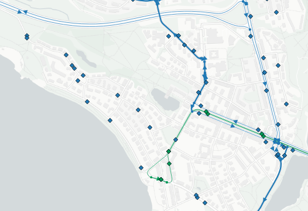
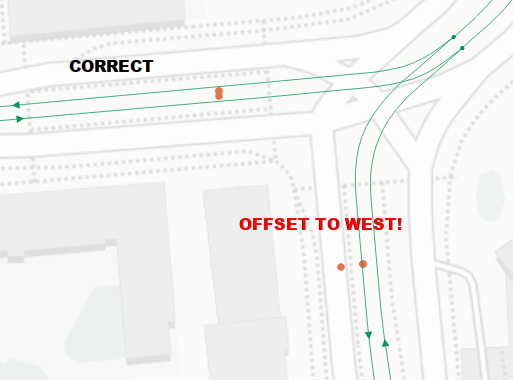
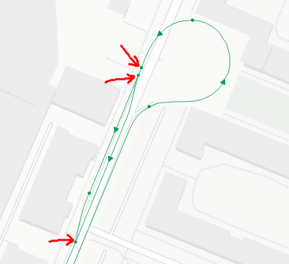
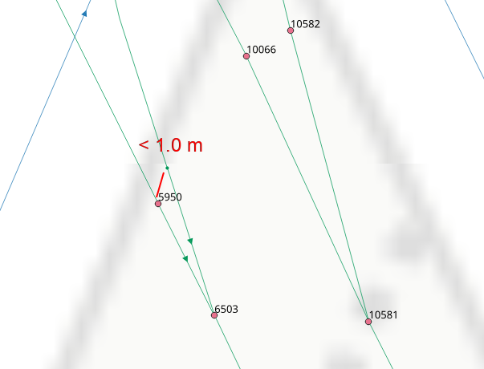
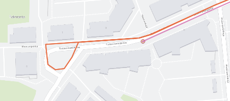
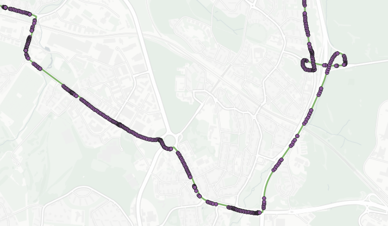

# Known issues

## Issues due to source data

These issues are particularly related to HSL-GTFS, OSM in HSL area or HFP.
They represent the data as of November 2019.

### Missing OSM bus relations

Unlike tram network that is based on all `railway=tram` links in the area, bus network is currently based on OSM ways that are part of at least one bus route relation.
This makes the number of ways to handle significantly smaller than if we extracted all the ways that buses could *possibly* use.
However, by doing this we basically assume that OSM users have modeled all the bus routes that we have in GTFS as well, but this is not true.
Some routes are outdated, and some routes such as minor local service routes are not found in OSM at all.

See `scripts/overpass_get_network_used_by_busroutes.sh` for more details on bus network extraction from OSM.

Below is an example from Munkkiniemi.

### Inaccurate GTFS stop locations

Some GTFS stop points are modeled inaccurately, which may cause stops to be snapped to a wrong link.
This particularly applies to tram network where opposite directions are modeled as separate oneway links.

Below is an example from Huutokonttori, Jätkäsaari.

For tram stops, this issue can be examined with `db/patches/find_missnapped_tram_stops.sql` and fixed manually with `db/patches/move_misplaced_stops.sql`.
Bus stops have not yet been reviewed but fixes on them can be appended to the same patch file.

Note that some stops are located correctly in the 2D map, but they might still be on a bridge and get incorrectly attached to the link going under that bridge, for example.
See e.g. stop `1341104 / 2304` in Kehä I, Pakila.
These stops have to be manually moved far away enough from incorrect links.

### Invalid OSM topology

Some OSM ways do not connect to each other as they should do and would seem to.
Instead of an end-to-end connection, they may touch each other, but this is not enough to form a working routing topology.

Example from Arabia.

This could be fixed by manually splitting the most critical spots from `stage_osm.combined_lines` or by automating the splitting process e.g. by using `ST_Touches()`, which would leave out any direct intersections of lines (e.g. bridges).
However, the latter would probably involve some nontrivial problems such as bus links following partly the same geometries on top of tram links, still without meaning that the links should be split.

### Topology tolerance value too high

There are OSM nodes that are closer to each other than the tolerance used in `pgr_createTopology`.
As of writing this, we have used a tolerance of `1.0 meters`.
This is apparently too high (example from Mannerheimintie-Nordenskiöldinkatu):

In this case, the node above `5950` is not included in the network topology, and pgRouting thinks that the merging tram tracks go both via `5950` and `6503`.
A smaller tolerance value should be used, though it should not be too low.

*2020-05-15: topology tolerance has now been set to 0.01, i.e. 1 cm, for `stage_nw.raw_nw` and `stage_nw.contracted_nw`.
nw.links already had that tolerance.*

### Incomplete GTFS route identifiers

See `scripts/import_gtfs.sql` notes:

*HSL has some bus and tram route variants indicated by a trailing whitespace and a digit, e.g. "1001" -> variant "1001 3" but these seem not to have propagated correctly to the GTFS dataset:
instead, the trailing whitespace+digit are left out from the route_id, but they are still visible in the beginning of the trip_id (all HSL trip_ids start with the route identifier).*

This issue is fixed in the aforementioned import script.

### Service dates and > 24 hrs trip start times

*NOTE: This may be either due to the data model or errors in HSL GTFS generation.*

Some night trips seem not to get any correct dates when made into `stage_gtfs.trips_with_dates`.
They seem to have initial departure times > 24 hrs (with GTFS 30-hour clock).
The problem is that `start_date` and `end_date` do not conform with the weekday definition in GTFS:
this is at least the case at the start of the GTFS dataset validity time.

For example, see trips with `service_id = '1020N_20191031_20191031_Ke'`.

## Routing issues

### Ignoring turning loops that should be part of the pattern path

In the example above, the orange line is the GTFS geometry, showing how the pattern itinerary goes through a turning loop after the stop point, so the "dead-end" part of the pattern can be traversed in the other direction.
The shortest path routing between stops (run in `stage_gtfs` schema) cannot take this into account but turns back immediately after the stop.
This makes the network path too short and incorrect.

Currently, using turn-restricted routing algorithm would not help, since the routing is done separately for each stop pair, so the stop pair occurring after the back turn does not "know" that the link just before the stop was just traversed in the other direction.
These cases just have to be detected as too short path sections (path vs. GTFS distance) and fixed manually.

## HFP issues

### Missing coordinates

GPS coordinates are missing from some observations.
However, these points need not be discarded in case there are reasonable odometer values available for linear interpolation.

